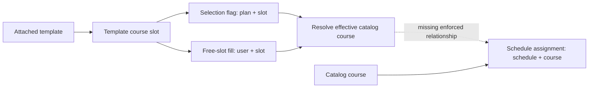

# UWPlan database schema audit

**Recommendation: fix the selected-course lifecycle first, then simplify its representation.** Issue [#19](https://github.com/pl3lee/uwplan/issues/19) is reproducible on current main. The underlying problem is that a schedule references a catalog course without recording or enforcing why that course belongs to the user's plan. Several independent operations must remember to maintain that relationship; most currently do not.

Audited revision: `4baa8321ce3be38dd397b812ca70ae3ba43de3eb`, fetched from `origin/main` on September 13, 2026. Scope: all 15 application PostgreSQL tables, retained Drizzle migrations, Goose adoption, sqlc queries, repository/domain behavior, and relevant regression coverage. No production data was queried. Findings about invalid data describe states the schema permits, not measured production corruption. No runtime or schema changes were made.

## How the current model works

The UI's “academic plan” is a **template** in the database. The database's `plan` is a user's planning workspace, with a unique `user_id`. Keeping those concepts distinct makes issue #19 easier to reason about.

| Area | Tables | Current responsibility |
| --- | --- | --- |
| Identity | `user`, `account`, `session`, `verification_token` | Profiles and provider links; the latter two are retained legacy tables, while current sessions/OAuth state use Redis |
| Catalog and definitions | `course`, `template`, `template_item`, `course_item` | Course catalog, reusable templates, display/requirement blocks, and individual fixed/free slots |
| User choices | `plan`, `plan_template`, `selected_course`, `free_course` | Workspace, attached templates, slot selection flags, and user-specific free-slot contents |
| Scheduling | `schedule`, `schedule_course`, `user_term_range` | Alternative schedules, course placements, and a user-wide visible term range |

Multiple selected slots can legitimately resolve to one course. The scheduler needs a **set of courses with at least one active source**, while the selection UI needs the individual source slots. Both concepts are necessary; conflating them causes the complexity.

## Findings, in priority order

### 1. High — Schedule membership has no enforced selected-course lifecycle

**Confirmed behavior defect; directly explains #19.** `schedule_course` has foreign keys to `schedule` and `course`, but none tying the assignment to an active selection in that schedule's plan. The compound primary key correctly prevents duplicate placements within one schedule, but cannot prevent an unsupported placement. See the [assignment schema][assignment-schema].

The [membership mutation][membership-write] detaches the template and sets its selection flags false, then commits. `SetChoice` and `ChangeFreeCourse` also commit without schedule reconciliation. Template deletion cascades through memberships, definition slots, fills, and selections, but cannot reach assignments through that chain. Only [explicit course removal][course-removal] deletes assignments from the plan's schedules.

Isolated repository tests against PostgreSQL reproduced these outcomes:

| Action after scheduling CS135 | Effective selection afterward | Actual assignment afterward |
| --- | --- | --- |
| Detach its only template; or uncheck its only slot | None | CS135 remains |
| Replace a selected free slot with CS136; or clear it | CS136; or none | CS135 remains |
| Delete its template | None | CS135 remains |
| Detach one of two templates selecting CS135; then detach the last | CS135; then none | CS135 remains after both steps |
| Explicitly remove CS135 through `RemoveCourse` | None | Removed correctly |

There is also an entry path: [assignment SQL][assignment-write] validates ownership and course existence, but never checks selection eligibility. The audit successfully assigned a never-selected course. A delayed assignment request can therefore recreate a placement after removal has completed. `Assign` also does not participate in the plan-row locking used by selection mutations. Adding an isolated cleanup query to detachment would leave this invariant incomplete.

**Recommended correction:** define active selection sources once; after every source-removing mutation, remove assignments only when no active source remains. Apply this to all schedules in the affected plan. Assignment must validate against that same definition while participating in the same transaction/locking protocol. Template deletion affects multiple users, so its affected-plan discovery and lock ordering require explicit design; simply adding plan locks after its current delete can introduce deadlocks with existing plan-then-template operations.

Do not link an assignment to just one template slot with `ON DELETE CASCADE`: deleting that slot would remove a course still selected through another template, violating #19's explicit requirement.

### 2. Medium — “Selected course” has conflicting definitions and ownership scopes

**Confirmed inconsistency for schema-valid data; current selection writes normally guard membership.** `selected_course` means a flag on a template slot, not a selected catalog course. `free_course` stores the slot's course under `user_id`, while flags and schedules use `plan_id`. The unique plan-per-user index makes those scopes equivalent today, but every consumer has to reconstruct that equivalence.

The [Select query][selection-read] starts from `plan_template`, so unattached slots disappear. The [Schedule query][schedule-read] starts from `selected_course` and never joins `plan_template`. The database permits a true selection without an attached template. An audit probe inserted exactly that state: Select returned zero templates/choices while Schedule returned one selected course. Existing repository fixtures also contain selections without memberships, making this divergence easy to overlook.

Absence of a flag and an explicit `selected=false` both mean unselected. Free fills may exist while unselected, empty selected slots are permitted, and detachment deliberately retains free-slot input. Those states are partly intentional: the membership integration test explicitly expects a retained fill after reattachment. They should not all be classified as corrupt or deleted during normalization.

**Recommended correction:** introduce a shared relation/query for active selection sources with `(plan_id, course_item_id, resolved_course_id)`, requiring attached membership, a true flag, and a resolved course. Derive the distinct course set for scheduling from it. A later `plan_choice(plan_id, course_item_id, selected, filled_course_id)` representation could consolidate user-specific state, while retaining dormant input intentionally. Specify detached-draft behavior before adding membership foreign keys that would erase it.

Preserve existing export behavior: the current schedule query returns one course per selected slot, the web scheduler deduplicates by course ID, and CSV deliberately retains occurrences. The [removal integration test][removal-test] documents that contract. Silently adding `DISTINCT` to the current shared export query would change it.

### 3. Medium — Important value and subtype invariants exist only in application code

**Confirmed database acceptance; generally prevented by current public write validation.** PostgreSQL accepted all of these isolated probes:

| Missing invariant | Accepted state | Consequence |
| --- | --- | --- |
| Fixed/free slot shape and parent kind | Fixed slot without a course; free slot with a fixed course; slot under a separator; fill attached to a fixed slot | Consumers resolve or render conflicting/invisible state |
| Term validity | `schedule_course.term = 'not a term'`; invalid year bounds in `user_term_range` | The malformed assignment made the entire repository schedule view fail during term parsing |
| Ordered-item uniqueness | Two `template_item` rows at the same template position | Position is ambiguous despite deterministic UUID tie-breaking |
| Email identity rule | Another user with `AUDIT@example.test` alongside `audit@example.test` | Database does not enforce the case-insensitive rule used during account provisioning |

Use same-row checks for fixed/free course nullability, valid years, and local values. Parent-kind checks require a structural relationship or carefully designed trigger; a normal `CHECK` cannot enforce arbitrary cross-table membership. Start with a validated representation for assignment terms that remains readable by the retained release. If retaining the term string, enforce a domain-compatible canonical format and year bounds; if splitting season/year, preserve compatibility during transition. The enum's declaration order is Fall/Winter/Spring, so enum comparison alone is not academic chronology.

For email, the current resolver serializes provider identity and lowercased email with advisory locks. This is **not a demonstrated concurrent-sign-in vulnerability**. The schema lacks a durable safeguard and an index for `lower(email)`. Check existing duplicates before introducing case-insensitive uniqueness, and preserve user IDs/provider links when resolving any collisions.

Do not assume every rating should be constrained to 0–1: repository fixtures contain values such as 4.250. Establish the catalog's actual contract first.

### 4. Medium — Index coverage does not match several common relationship traversals

**Schema/query evidence; production performance impact unmeasured.** The [complete index inventory][indexes] omits indexes beginning with `template_item.template_id` and `schedule.plan_id`, despite filtering/joining on them in ordinary template and schedule reads. A primary key on the child UUID does not serve that lookup.

Prioritize these candidates for representative `EXPLAIN (ANALYZE, BUFFERS)` measurements:

| Candidate | Relevant workload |
| --- | --- |
| `template_item(template_id, order_index, id)` | Template definition reads and template cascades |
| `schedule(plan_id, id)` | A user's schedules and plan-wide assignment cleanup |
| `plan_template(template_id, plan_id)` | Discovering all users affected by template deletion |
| `selected_course(course_item_id, plan_id)` | Slot/template deletion cascades; current PK starts with plan |
| `lower(user.email)`; `template(created_by)` | Provisioning lookup and owned-template management, subject to realistic selectivity |

Also assess reverse course references on `free_course(filled_course_id)` and `schedule_course(course_id)` if catalog deletion is supported. The existing `course_code_idx` duplicates the unique index backing `course_code_unique`. The global `schedule_course_term_idx` has no matching filter in the current query set. These are cleanup candidates, not evidence that every index should immediately be added or dropped. Account, plan ownership, and several slot lookups already have useful indexes.

### 5. Low — Course-slot ordering relies on identity rather than an explicit position

**Structural limitation; not a reproduced new-write ordering regression.** Template blocks have `order_index`, but their `course_item` children have no position. [Definition loading][template-read] orders course slots by UUID. New UUIDv7 generation tends to preserve creation order; retained UUIDv4 identities do not encode author order. The schema cannot represent reordering the same slots without relying on incidental identity order.

Add a slot position only if authored order is part of the product contract. Backfill from the current displayed UUID order so migration does not reshuffle existing templates. The original author order of historical random IDs cannot be reconstructed from this schema alone. Do not regenerate IDs to impose ordering: selections and fills reference them.

## Other design observations

1. **Template origin is overloaded onto nullable ownership.** Seeding treats `created_by IS NULL` as built-in, while deleting a creator sets the same field null. A future user-deletion workflow could make an orphaned custom template appear built-in to the seed logic. Use explicit origin/stable seed identity if evolving this area. Global template-name uniqueness is an existing product contract, not automatically a normalization bug.
2. **Catalog deletion has inconsistent consequences.** Deleting an unscheduled catalog course cascades into fixed slots and free fills; a scheduled course is protected by a non-cascading assignment FK. Current refresh uses transactional upserts preserving IDs and does not prune missing courses, so this is a future deletion-policy risk. Prefer retirement/status semantics for catalog history rather than silently deleting requirements.
3. **Legacy identity tables/columns are deliberate compatibility debt.** Current code uses Redis sessions and writes only provider identity into `account`; legacy session/token tables and token columns remain. Defer removal until the retained rollback release no longer needs them. Mixed text user IDs and UUID planning IDs preserve legacy identity and are not a reason to rewrite IDs.
4. **The one-plan-per-user model is coherent today.** A shared user term range and user-scoped fills become problematic if multiple independent plans are introduced, but removing the `plan` table now would spread ownership changes across references without fixing #19. Required initial plan/schedule/range rows are established transactionally; final-schedule deletion already uses a plan lock.

## Recommended implementation sequence

1. **Repair the invariant with the current schema.** Share the active-source query, reconcile assignments after source changes, and validate assignments under a consistent concurrency protocol. Add cross-lifecycle tests for the reproduction matrix, multiple schedules/users, duplicate fixed/free sources, and delayed/concurrent assignment versus removal. Clean up existing unsupported assignments through an explicit, reviewed data repair using the same source definition.
2. **Harden and simplify incrementally.** Add measured indexes and audited value constraints. Consolidate selection/fill storage only after specifying retained drafts and legacy CSV behavior. Prefer a view or shared query first: a persisted `plan_course` table adds synchronization work of its own. If introduced later, it needs a real transactionally maintained lifecycle, and an assignment FK must also enforce that the course and schedule belong to the same plan.
3. **Ship compatible migrations.** Keep Goose baseline v1 and its fingerprint immutable. Add a new version, extend sqlc's schema inputs beyond the legacy snapshot, and include every migration input in the pgtestdb migration hash. Test empty setup, legacy adoption plus upgrade, and the retained application's reads/writes against the expanded schema. Deployment runs migrations before stopping prior writers, and rollback retains candidate writes; renamed/dropped columns or constraints incompatible with old writers cannot be the first step.

The architectural target is one planning module whose interface guarantees: **every scheduled course has at least one active selection source in its own plan**. It can contain separate selection and scheduling adapters internally, but callers should not have to know which mutation requires extra cleanup.

## Validation and limits

`GOFLAGS=-v make test-integration` was run through the repository's isolated PostgreSQL 16.14 runner. The existing suite and 19 audit scenarios passed, including empty bootstrap, legacy data-preserving adoption, and schema-drift rejection. The audit scenarios assert observed current behavior, including defects; passing does not mean the desired lifecycle is correct.

The probe source is retained as [an inert audit attachment](audits/2026-09-13-schema-probes.go.txt), with [test evidence](audits/2026-09-13-schema-results.txt). To reproduce on the audited revision, temporarily copy the attachment to `api/internal/repository/selection/schema_audit_integration_test.go`, run the command from `api/`, and remove that temporary file afterward. These observations must not become desired-behavior regression tests.

No browser suite, production data inspection, production query plan measurement, or deployment rehearsal was run for this report. Browser source was inspected to establish the coverage gap; actual production prevalence and performance remain unknown.

[assignment-schema]: https://github.com/pl3lee/uwplan/blob/4baa8321ce3be38dd397b812ca70ae3ba43de3eb/api/migrations/legacy_schema.sql#L239
[membership-write]: https://github.com/pl3lee/uwplan/blob/4baa8321ce3be38dd397b812ca70ae3ba43de3eb/api/internal/repository/selection/impl.go#L83
[course-removal]: https://github.com/pl3lee/uwplan/blob/4baa8321ce3be38dd397b812ca70ae3ba43de3eb/api/internal/repository/selection/impl.go#L168
[assignment-write]: https://github.com/pl3lee/uwplan/blob/4baa8321ce3be38dd397b812ca70ae3ba43de3eb/api/internal/repository/db/queries/schedule.sql#L30
[selection-read]: https://github.com/pl3lee/uwplan/blob/4baa8321ce3be38dd397b812ca70ae3ba43de3eb/api/internal/repository/db/queries/selection.sql#L7
[schedule-read]: https://github.com/pl3lee/uwplan/blob/4baa8321ce3be38dd397b812ca70ae3ba43de3eb/api/internal/repository/db/queries/schedule.sql#L22
[removal-test]: https://github.com/pl3lee/uwplan/blob/4baa8321ce3be38dd397b812ca70ae3ba43de3eb/api/internal/repository/selection/removal_integration_test.go
[indexes]: https://github.com/pl3lee/uwplan/blob/4baa8321ce3be38dd397b812ca70ae3ba43de3eb/api/migrations/legacy_schema.sql#L194
[template-read]: https://github.com/pl3lee/uwplan/blob/4baa8321ce3be38dd397b812ca70ae3ba43de3eb/api/internal/repository/db/queries/template.sql#L20
